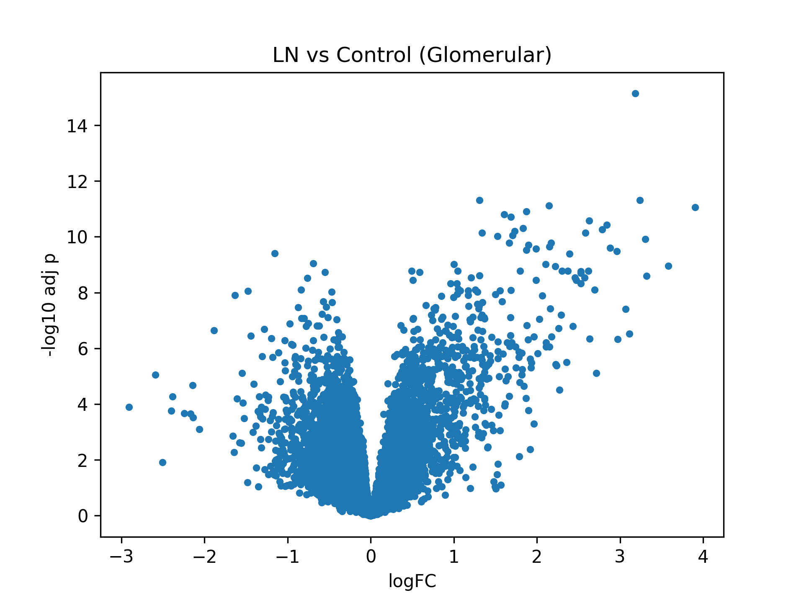

# Lupus Nephritis Glomerular Signature

Which genes are most strongly dysregulated in glomerular lupus nephritis compared with control glomerular tissue?

---

## Key Findings

* Lupus nephritis glomeruli show strong upregulation of interferon-related and immune-response genes
* Prioritized genes include IFI44, IFI44L, MX1, TYROBP, C1QA, and MX2
* The molecular pattern is consistent with inflammatory and immune-mediated glomerular injury

---

## Clinical Context

Lupus nephritis is one of the most serious organ manifestations of systemic lupus erythematosus and a major cause of renal morbidity.

Although clinical classification remains essential, transcriptomic profiling can help identify molecular processes associated with glomerular injury and immune activation.

This project focuses specifically on the **glomerular compartment**, aiming to identify biologically coherent gene-expression signals linked to lupus nephritis.

---

## Dataset

* **GEO accession:** GSE32591
* **Tissue compartment:** glomerular biopsy samples
* **Comparison:** lupus nephritis vs control
* **Final cohort used:** 46 samples

  * 32 lupus nephritis
  * 14 controls

---

## Methods

### R

* GEO data retrieval with `GEOquery`
* Differential expression analysis with `limma`

### Python

* Post-processing and ranking of differentially expressed genes
* Volcano plot generation

---

## Workflow

1. Download and load GSE32591
2. Export phenotype and expression matrices
3. Filter glomerular samples only
4. Define lupus nephritis vs control groups
5. Run differential expression with `limma`
6. Rank genes by effect size and adjusted p-value
7. Generate volcano plot

---

## Main Outputs

* `results/tables/ln_glomerular_limma_results.tsv`
* `results/tables/ln_glomerular_prioritized.tsv`
* `results/tables/ln_glomerular_top20.tsv`
* `results/figures/volcano_plot.png`

---

## Biological Interpretation

Top-ranked genes included:

* IFI44
* IFI44L
* MX1
* TYROBP
* C1QA
* MX2

These genes are consistent with:

* interferon-driven immune activation
* inflammatory signaling
* innate immune cell involvement in glomerular injury

This pattern is clinically coherent with the known immunopathology of lupus nephritis.

---

## Interpretation

This analysis supports the idea that glomerular lupus nephritis is characterized by a strong immune and interferon-related molecular signature.

Rather than serving as a complex pipeline showcase, the project aims to provide a clear and reproducible example of transcriptomic analysis applied to a clinically meaningful nephrology question.

---

## Limitations

* Public dataset with fixed cohort composition
* Cross-sectional comparison
* No integration with longitudinal renal outcomes or treatment response
* Focus limited to one tissue compartment

---

## Why This Matters

This project demonstrates that:

* transcriptomic analysis can recover biologically meaningful signals in glomerular lupus nephritis
* immune-related signatures remain highly informative in renal tissue
* clinically oriented bioinformatics projects can be both reproducible and interpretable

---

## Reproducibility

Repository structure:

* `data/`
* `docs/`
* `notebooks/`
* `python/`
* `r/`
* `results/figures/`
* `results/tables/`

Key outputs include differential expression tables, prioritized gene lists, and the final volcano plot.

---

## Scope and Disclaimer

**Status:** public-data reanalysis — hypothesis-generating, single tissue compartment, no longitudinal outcomes. Not a validated clinical tool, not a medical device, no regulatory clearance. Results must not be used for patient-level decisions.

**Data provenance:** public GEO microarray dataset GSE32591 (glomerular biopsy samples). No identifiable patient data are used or shared.

## Author

**Cristian Arias Ramírez, MD, MSc** — Nephrologist & Internal Medicine Specialist · MSc Bioinformatics and Precision Medicine (Universidad Alfonso X el Sabio, 2026)

[LinkedIn](https://www.linkedin.com/in/cristian-arias-healthcare-data/) · [Full portfolio](https://github.com/broncox456)
